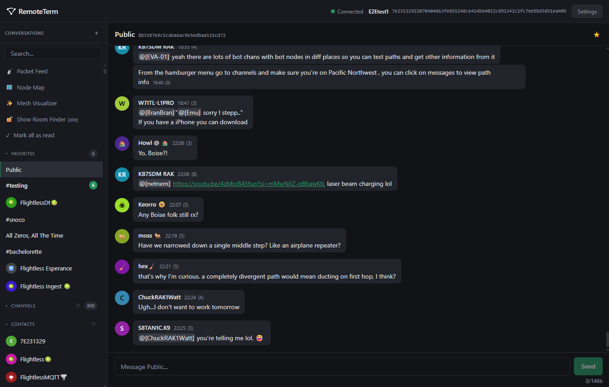

# RemoteTerm for MeshCore

Backend server + browser interface for MeshCore mesh radio networks. Connect your radio over Serial, TCP, or BLE, and then you can:

* Send and receive DMs and channel messages
* Cache all received packets, decrypting as you gain keys
* Run multiple Python bots that can analyze messages and respond to DMs and channels
* Monitor unlimited contacts and channels (radio limits don't apply -- packets are decrypted server-side)
* Access your radio remotely over your network or VPN
* Search for hashtag room names for channels you don't have keys for yet
* Forward packets to MQTT brokers (private: decrypted messages and/or raw packets; community aggregators like LetsMesh.net: raw packets only)
* Visualize the mesh as a map or node set, view repeater stats, and more!

**Warning:** This app has no auth, and is for trusted environments only. _Do not put this on an untrusted network, or open it to the public._ The bots can execute arbitrary Python code which means anyone on your network can, too. If you need access control, consider using a reverse proxy like Nginx, or extending FastAPI; access control and user management are outside the scope of this app.



## Disclaimer

This is developed with very heavy agentic assistance -- there is no warranty of fitness for any purpose. It's been lovingly guided by an engineer with a passion for clean code and good tests, but it's still mostly LLM output, so you may find some bugs.

If extending, have your LLM read the three `AGENTS.md` files: `./AGENTS.md`, `./frontend/AGENTS.md`, and `./app/AGENTS.md`.

## Requirements

- Python 3.10+
- Node.js 18+
- [UV](https://astral.sh/uv) package manager: `curl -LsSf https://astral.sh/uv/install.sh | sh`
- MeshCore radio connected via USB serial, TCP, or BLE

<details>
<summary>Finding your serial port</summary>

```bash
#######
# Linux
#######
ls /dev/ttyUSB* /dev/ttyACM*

#######
# macOS
#######
ls /dev/cu.usbserial-* /dev/cu.usbmodem*

###########
# Windows
###########
# In PowerShell:
Get-CimInstance Win32_SerialPort | Select-Object DeviceID, Caption

######
# WSL2
######
# Run this in an elevated PowerShell (not WSL) window
winget install usbipd
# restart console
# then find device ID
usbipd list
# make device shareable
usbipd bind --busid 3-8 # (or whatever the right ID is)
# attach device to WSL (run this each time you plug in the device)
usbipd attach --wsl --busid 3-8
# device will appear in WSL as /dev/ttyUSB0 or /dev/ttyACM0
```
</details>

## Quick Start

**This approach is recommended over Docker due to intermittent serial communications issues I've seen on \*nix systems.**

```bash
git clone https://github.com/jkingsman/Remote-Terminal-for-MeshCore.git
cd Remote-Terminal-for-MeshCore

# Install backend dependencies
uv sync

# Build frontend
cd frontend && npm install && npm run build && cd ..

# Run server
uv run uvicorn app.main:app --host 0.0.0.0 --port 8000
```

The server auto-detects the serial port. To specify a transport manually:
```bash
# Serial (explicit port)
MESHCORE_SERIAL_PORT=/dev/ttyUSB0 uv run uvicorn app.main:app --host 0.0.0.0 --port 8000

# TCP (e.g. via wifi-enabled firmware)
MESHCORE_TCP_HOST=192.168.1.100 MESHCORE_TCP_PORT=4000 uv run uvicorn app.main:app --host 0.0.0.0 --port 8000

# BLE (address and PIN both required)
MESHCORE_BLE_ADDRESS=AA:BB:CC:DD:EE:FF MESHCORE_BLE_PIN=123456 uv run uvicorn app.main:app --host 0.0.0.0 --port 8000
```

On Windows (PowerShell), set environment variables as a separate statement:
```powershell
$env:MESHCORE_SERIAL_PORT="COM8" # or your COM port
uv run uvicorn app.main:app --host 0.0.0.0 --port 8000
```

Access at http://localhost:8000

> **Note:** WebGPU cracking requires HTTPS when not on localhost. See the HTTPS section under Additional Setup.

## Docker Compose

> **Warning:** Docker has intermittent issues with serial event subscriptions. The native method above is more reliable.

> **Note:** BLE-in-docker is outside the scope of this README, but the env vars should all still work.

Edit `docker-compose.yaml` to set a serial device for passthrough, or uncomment your transport (serial or TCP). Then:

```bash
docker compose up -d
```

The database is stored in `./data/` (bind-mounted), so the container shares the same database as the native app. To rebuild after pulling updates:

```bash
docker compose up -d --build
```

To use the prebuilt Docker Hub image instead of building locally, replace:

```yaml
build: .
```

with:

```yaml
image: jkingsman/remoteterm-meshcore:latest
```

Then run:

```bash
docker compose pull
docker compose up -d
```

The container runs as root by default for maximum serial passthrough compatibility across host setups. On Linux, if you switch between native and Docker runs, `./data` can end up root-owned. If you do not need that compatibility behavior, you can enable the optional `user: "${UID:-1000}:${GID:-1000}"` line in `docker-compose.yaml` to keep ownership aligned with your host user.

To stop:

```bash
docker compose down
```

## Development

### Backend

```bash
uv sync
uv run uvicorn app.main:app --reload # autodetects serial port

# Or with explicit serial port
MESHCORE_SERIAL_PORT=/dev/ttyUSB0 uv run uvicorn app.main:app --reload
```

On Windows (PowerShell):
```powershell
uv sync
$env:MESHCORE_SERIAL_PORT="COM8" # or your COM port
uv run uvicorn app.main:app --reload
```

> **Windows note:** I've seen an intermittent startup issue like `"Received empty packet: index out of range"` with failed contact sync. I can't figure out why this happens. The issue typically resolves on restart. If you can figure out why this happens, I will buy you a virtual or iRL six pack if you're in the PNW. As a former always-windows-girlie before embracing WSL2, I despise second-classing M$FT users, but I'm just stuck with this one.

### Frontend

```bash
cd frontend
npm install
npm run dev      # Dev server at http://localhost:5173 (proxies API to :8000)
npm run build    # Production build to dist/
```

Run both the backend and `npm run dev` for hot-reloading frontend development.

### Code Quality & Tests

Please test, lint, format, and quality check your code before PRing or committing. At the least, run a lint + autoformat + pyright check on the backend, and a lint + autoformat on the frontend.

Run everything at once (parallelized):

```bash
./scripts/all_quality.sh
```

<details>
<summary>Or run individual checks</summary>

```bash
# python
uv run ruff check app/ tests/ --fix  # lint + auto-fix
uv run ruff format app/ tests/       # format (always writes)
uv run pyright app/                  # type checking
PYTHONPATH=. uv run pytest tests/ -v # backend tests

# frontend
cd frontend
npm run lint:fix                     # esLint + auto-fix
npm run test:run                     # run tests
npm run format                       # prettier (always writes)
npm run build                        # build the frontend
```
</details>

## Configuration

| Variable | Default | Description |
|----------|---------|-------------|
| `MESHCORE_SERIAL_PORT` | (auto-detect) | Serial port path |
| `MESHCORE_SERIAL_BAUDRATE` | 115200 | Serial baud rate |
| `MESHCORE_TCP_HOST` | | TCP host (mutually exclusive with serial/BLE) |
| `MESHCORE_TCP_PORT` | 4000 | TCP port |
| `MESHCORE_BLE_ADDRESS` | | BLE device address (mutually exclusive with serial/TCP) |
| `MESHCORE_BLE_PIN` | | BLE PIN (required when BLE address is set) |
| `MESHCORE_LOG_LEVEL` | INFO | DEBUG, INFO, WARNING, ERROR |
| `MESHCORE_DATABASE_PATH` | data/meshcore.db | SQLite database path |

Only one transport may be active at a time. If multiple are set, the server will refuse to start.

## Additional Setup

<details>
<summary>HTTPS (Required for WebGPU room-finding outside localhost)</summary>

WebGPU requires a secure context. When not on `localhost`, serve over HTTPS:

```bash
openssl req -x509 -newkey rsa:4096 -keyout key.pem -out cert.pem -days 365 -nodes -subj '/CN=localhost'
uv run uvicorn app.main:app --host 0.0.0.0 --port 8000 --ssl-keyfile=key.pem --ssl-certfile=cert.pem
```

For Docker Compose, generate the cert and add the volume mounts and command override to `docker-compose.yaml`:

```bash
# generate snakeoil TLS cert
openssl req -x509 -newkey rsa:4096 -keyout key.pem -out cert.pem -days 365 -nodes -subj '/CN=localhost'
```

Then add the key and cert to the `remoteterm` service in `docker-compose.yaml`, and add an explicit launch command that uses them:

```yaml
    volumes:
      - ./data:/app/data
      - ./cert.pem:/app/cert.pem:ro
      - ./key.pem:/app/key.pem:ro
    command: uv run uvicorn app.main:app --host 0.0.0.0 --port 8000 --ssl-keyfile=/app/key.pem --ssl-certfile=/app/cert.pem
```

Accept the browser warning, or use [mkcert](https://github.com/FiloSottile/mkcert) for locally-trusted certs.
</details>

<details>
<summary>Systemd Service (Linux)</summary>

Assumes you're running from `/opt/remoteterm`; update commands and `remoteterm.service` if you're running elsewhere.

```bash
# Create service user
sudo useradd -r -m -s /bin/false remoteterm

# Install to /opt/remoteterm
sudo mkdir -p /opt/remoteterm
sudo cp -r . /opt/remoteterm/
sudo chown -R remoteterm:remoteterm /opt/remoteterm

# Install dependencies
cd /opt/remoteterm
sudo -u remoteterm uv venv
sudo -u remoteterm uv sync

# Build frontend (required for the backend to serve the web UI)
cd /opt/remoteterm/frontend
sudo -u remoteterm npm install
sudo -u remoteterm npm run build

# Install and start service
sudo cp /opt/remoteterm/remoteterm.service /etc/systemd/system/
sudo systemctl daemon-reload
sudo systemctl enable --now remoteterm

# Check status
sudo systemctl status remoteterm
sudo journalctl -u remoteterm -f
```

Edit `/etc/systemd/system/remoteterm.service` to set `MESHCORE_SERIAL_PORT` if needed.
</details>

<details>
<summary>Testing</summary>

**Backend:**

```bash
PYTHONPATH=. uv run pytest tests/ -v
```

**Frontend:**

```bash
cd frontend
npm run test:run
```

**E2E:**

Warning: these tests are only guaranteed to run correctly in a narrow subset of environments; they require a busy mesh with messages arriving constantly and an available autodetect-able radio, as well as a contact in the test database (which you can provide in `tests/e2e/.tmp/e2e-test.db` after an initial run). E2E tests are generally not necessary to run for normal development work.

```bash
cd tests/e2e
npx playwright test # headless
npx playwright test --headed # show the browser window
```
</details>

## API Documentation

With the backend running: http://localhost:8000/docs

## Debugging & Bug Reports

If you're experiencing issues or opening a bug report, please start the backend with debug logging enabled. Debug mode provides a much more detailed breakdown of radio communication, packet processing, and other internal operations, which makes it significantly easier to diagnose problems.

To start the server with debug logging:

```bash
MESHCORE_LOG_LEVEL=DEBUG uv run uvicorn app.main:app --host 0.0.0.0 --port 8000
```

Please include the relevant debug log output when filing an issue on GitHub.
